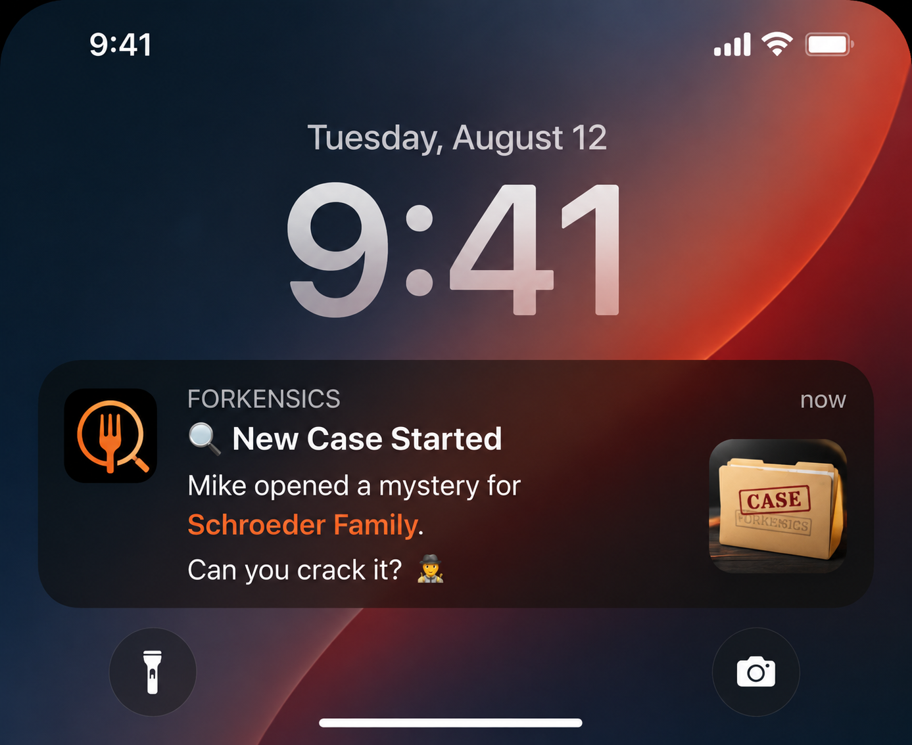

# Forkensics — Product Backlog
Future features and ideas captured for later steps. Not committed to any release timeline.

---

## FEAT-001 — Orders To Go

**Summary:** A saved list of dishes/restaurants players want to order in real life.

**Origin:** Bill — August 2026

**User story:** After seeing a dish in a case, a player thinks "I want to eat that." They tap a button (or use the iOS share sheet from a screenshot) to save it to their "Orders To Go" list. The app already has the restaurant name and location, so it can enrich the entry automatically with a phone number and website link.

**Proposed tab:** Orders To Go — appears in the main tab bar alongside the case feed and profile.

**Data sources:**
- Restaurant name + location → already on the case
- Phone + website → Google Places API or Yelp Fusion API lookup by name + city

**Two save entry points:**
1. **In-app:** "Save to Orders To Go" button on any case card — instant, no API needed until user opens the entry.
2. **Share sheet / screenshot:** User screenshots something outside the app and shares to Forkensics → app attempts to extract dish/restaurant via vision API (OCR). More complex; can be Phase 2 of this feature.

**Technical notes:**
- Places API: ~$0.017/call (Google) — low cost at early user volumes.
- OCR path requires Apple Vision framework or a cloud vision API.
- `orders_to_go` table: `(id, player_id, case_id nullable, restaurant_name, restaurant_phone, restaurant_website, dish_name, saved_at, ordered_at nullable)`.
- `ordered_at` lets players mark it done ("I finally tried it!") — potential social sharing moment.

**Status:** Backlog — design + API cost estimate needed before scoping into a step.

---

## FEAT-002 — Notification Design System

**Summary:** Establish a consistent notification voice and visual language for all Forkensics push notifications.

**Origin:** Bill — August 2026

**Reference mockup:** `04_UX/notification-references/notification-new-case-mockup.png`

**Mockup details:**
- App icon: fork + magnifying glass on black background, orange accent — strong, distinctive lock screen presence.
- Title: **🔎 New Case Started** — action-oriented, mystery framing.
- Body: "[Poster name] opened a mystery for **[Table name]**. Can you crack it? 🕵️" — Table name highlighted in orange (rich notification).
- Thumbnail: manila case folder stamped "CASE — FORKENSICS" — reinforces the detective theme visually.

**Approved notification patterns from proposal doc:**

| Trigger | Title | Body |
|---|---|---|
| New case launched | 🔎 New Case Started | [Name] opened a mystery for [Table]. Can you crack it? 🕵️ |
| Waiting on player's guess | 🔎 Your Turn | [Table] is waiting on your guess |
| All guesses in | 🔎 Everyone's In | All detectives submitted — reveal coming [time] |
| Case revealed | 🔎 Case Closed | See how [Table] did on [dish name] |
| Table Talk reply | 🔎 New Message | [Name] replied in [Table] |

**Notes:**
- Table names highlighted in orange in notification body (requires rich notification payload with attributed string or HTML-lite formatting — iOS supports `NSAttributedString` in notification content extensions).
- Thumbnail attachment: case folder image served from CDN, included in `UNNotificationAttachment`.
- Notification categories: `NEW_CASE`, `YOUR_TURN`, `REVEAL`, `TABLE_TALK` — each with appropriate actions (e.g., NEW_CASE gets a "Guess Now" action button).

**Status:** Backlog — notification infrastructure is an Edge Function step; this doc provides the design spec when that step is scoped.

---

## FEAT-003 — Tables Naming (UX Language Decision)

**Summary:** User-facing name for groups is **Tables**, not "Groups."

**Origin:** Bill — August 2026

**Confirmed:** Yes — all UI copy, notifications, and proposal docs use "Tables." Internal DB schema retains `groups` table name (TABLE is a reserved word in SQL).

**Affected copy:**
- "Choose your detectives" → "Choose your Tables"
- "Your detective groups" → "Your Tables"
- Notification body: "for **Schroeder Family**" (Table name, not "group name")
- Onboarding: "Create a Table" / "Join a Table"
- Settings: "My Tables"

**Status:** Confirmed decision — update Step 26 proposal Rev 2 and all future UX docs.

---
